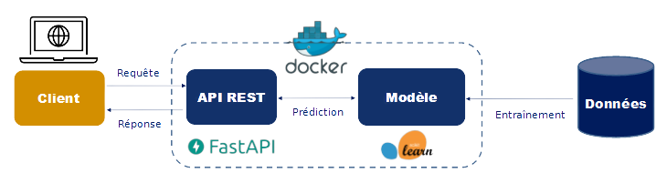

# Qui sommes-nous ?

- Des data scientists de l'Insee
    - obsédés par la notion de **reproductibilité**
    - frustrés par l'approche souvent purement technique de la data science
    - convaincus que les **bonnes pratiques** valent à être enseignées

<romain.avouac@insee.fr>, <lino.galiana@insee.fr>

---

# Introduction

----

### Disclaimers

- Contenu en construction : 

https://hungry-hodgkin-0a5a81.netlify.app

- Programme large

- Applications guidées

----

### Vue d'ensemble

- **Public visé** : praticiens de la data science

- **But** : répondre à des sujets pratiques
    - travail collaboratif
    - partage de code
    - mise en production
    - valoriser un modèle de data science
    - automatiser et industrialiser

- **Horizon** : un rôle d'interface entre le métier et la technique

----

### La notion de bonnes pratiques

- **Origine** : communauté des développeurs logiciels

- **Constats** :
    - le code est plus souvent lu qu'écrit
    - la maintenance d'un code est très coûteuse

- **Conséquence** : ensemble de **règles informelles**, conventionnellement acceptées comme produisant des logiciels **fiables**, **évolutifs** et **maintenables**

----

### Pourquoi s'intéresser aux bonnes pratiques ?

- L'activité du data scientist tent à se rapprocher de celle du développeur :
    - projets intenses en code
    - **projets collaboratifs** et de grande envergure
    - **complexification** des données et donc des **infrastructures**
    - **déploiement** d'applications pour valoriser les analyses

----

### Bonnes pratiques et reproductibilité

**Source** : Peng R., Reproducible Research in Computational Science, Science (2011)

----

### Contenu du cours

- Voir le code comme un **outil de communication**
    - Structure des projets et qualité du code
    - Contrôle de version avec Git

- **Travail collaboratif** avec Git et GitHub

- Maximiser la **portabilité**

- **Déployer** et **valoriser** un projet de data science

- Outils techniques

----

### Approche pédagogique

- **Langages** :
    - Principes agnostiques au langage 
    - Exemples en **Python** et **R**

- **Environnement** : https://datalab.sspcloud.fr/
    - environnement de développement **normalisé**
    - simule un **environnement de production** réel
    - acquérir les **bonnes pratiques** de manière organique
        - conteneurisation
        - séparation code / données / environnement

---

# Qualité du code

----

### Enjeux 

- D'une vision utilitariste du code à une vision du code comme **outil de communication**

- Favoriser la **maintenabilité**

- Adopter les **standards communautaires** du langage

----

### Principes généraux

- Améliorer la **lisibilité**

- Favoriser la **concision**

- Assurer la **cohérence** interne

- Limiter la redondance

- **Documenter** son code

----

### Standards communautaires

- **Python** : [PEP8](https://peps.python.org/pep-0008/), [PEP 257](https://peps.python.org/pep-0257/)

- **R** : [Tidyverse style guide](https://style.tidyverse.org/index.html), [Google style guide](https://google.github.io/styleguide/Rguide.html)

- La **cohérence intra-projet** doit toujours primer

----

### Outils

- **Linters** : diagnostic de qualité du code
    - Python : [Pylint](https://github.com/PyCQA/pylint)
    - R : [lintr](https://github.com/r-lib/lintr)

- **Formatters** : application automatique des standards
    - Python : [Black](https://github.com/psf/black)
    - R : [styler](https://github.com/r-lib/styler)

---

# Structure des projets

----

### Enjeux

- Favoriser la **lisibilité** et la **maintenabilité**

- Enjeux spécifiques à la data science
    - **Expérimentation**
    - **Non-linéarité**
    - **Reproductibilité**

- Adopter les **standards communautaires** d'architecture

----

### Principes généraux

- Les données sont **immuables**
    - Pas de modifications manuelles
    - **Stockage externe** (ex : S3)

- **Notebooks** : pour l'**exploration** et la **communication**
    - Reproductibilité limitée
    - Mal gérés par le contrôle de version

- **Packages** : pour formaliser un **pipeline**
    - Modularité : **fonctions** dans des **modules**
    - Gestion des **dépendances**

----

### Standards communautaires / outils

- **Python** : *Cookiecutters* ([Cookiecutter Data Science](https://drivendata.github.io/cookiecutter-data-science/))

- **R** : *Projets RStudio* ([R for Data Science](https://r4ds.had.co.nz/workflow-projects.html))

- La **cohérence intra-projet** doit toujours primer

---

# Git : rappels

----

### Pourquoi utiliser Git ?

[Source](https://thinkr.fr/travailler-avec-git-via-rstudio-et-versionner-son-code/)

----

### Concepts essentiels

[Source](http://fabacademy.org/2021/labs/bhubaneswar/students/deepak-chaudhry/ia_PPFP.html)

----

### Bonnes pratiques

- Que versionne-t-on ?
    - Essentiellement du **code source**
    - **Pas de données**
    - Pas d'informations locales / sensibles
    - Pas d'outputs

- **Fréquence** des commits : le plus souvent possible tout en restant pertinent

- **Messages** des commits : **le pourquoi plutôt que le comment**

----

### En pratique

- Git est un **logiciel**

- Utilisation en **ligne de commande**

- Ressources sur le site :
    - [Introduction au terminal Linux](https://hungry-hodgkin-0a5a81.netlify.app/linux-101/)
    - [Rappels des commandes de base de Git](https://hungry-hodgkin-0a5a81.netlify.app/git/)

---

# Travail collaboratif avec Git

----

### Des outils pour mieux collaborer 

- **Git** :
    - branches

- **GitHub / GitLab** :
    - pull requests
    - forks
    - issues

- Ne remplacent pas une bonne organisation du travail d'équipe

----

### Branches

[Présentation détaillée sur le site du cours](https://hungry-hodgkin-0a5a81.netlify.app/git/#branches)

----

### Un modèle : le GitHub flow

[Présentation détaillée sur le site du cours](https://hungry-hodgkin-0a5a81.netlify.app/git/#workflow-collaboratif)

----

### Contribuer à un projet open-source

- **Issues** : bugs, suggestions, etc.

- **Pull requests** : proposer du code

- Procédure : 
    - créer un **fork** du projet
    - créer une **branche**
    - add/commit/push les changements proposés
    - ouvrir une **pull request** sur le repo cible

- Toujours suivre les règles de contribution

---

# Portabilité

----

### "It works... on my machine"

- On a construit un projet
    - Lisible et bien structuré
    - Versionné proprement avec Git

- Peut-on partager notre projet ?
    - En théorie, oui !
    - En pratique, c'est toujours plus compliqué...

----

### L'enjeu de la portabilité

- Un code ne vit jamais dans une bulle isolée, il contient en général de nombreuses **adhérences**
    - Des **dépendances** dans le langage du projet
    - Des dépendances dans d'autres langages
    - Des **librairies système**

- Un code est **portable** s'il peut être exécuté dans un environnement différent que celui du développement

- Il nous faut de **nouveaux outils** pour atteindre une portabilité forte

----

## Les environnements virtuels

----

### Introduction

- *Workflow* classique du data scientist qui commencerait ses premiers projets
    - Installer une distribution de `Python` sur son poste
    - Développer un projet en installant les packages nécessaires
    - Passer au projet suivant et ainsi de suite

- Quels problèmes peuvent se poser ?

----

### Enjeux

- **Conflits de version** : différents projets peuvent recquérir des versions différentes d'un même *package* ;
- **Version de Python fixe**, celle de l'installation système ;
- **Reproductibilité limitée** : difficile de dire quel projet nécessite quel package ;
- **Portabilité limitée** : difficile de fixer dans un fichier les dépendances spécifiques à un projet.

----

### Fonctionnement

- **Dossier auto-suffisant** qui contient :
    - Une installation de `Python` pour une version donnée ;
    - Des packages additionnels
et qui est **isolé** des autres environnements existants

- Développer dans des environnements virtuels vierges en début de projet est une bonne pratique pour la **reproductibilité**

----

### Implémentations

- Différentes implémentations en Python
    - L'implémentation standard est `venv`
    - L'implémentation la plus populaire en data science est `conda`

- `conda` est à la fois
    - Un *package manager* (comme `pip`)
    - Un gestionnaire d'environnements virtuels

----

### Installation

- `conda` est généralement installé dans le cadre de **distributions**
    - `Miniconda`
    - `Anaconda`

- `conda` est un outil en ligne de commandes (CLI)

----

### En pratique

- [Exercice guidé](https://hungry-hodgkin-0a5a81.netlify.app/portability/#en-pratique)

- [Aide-mémoire des principales commandes](https://hungry-hodgkin-0a5a81.netlify.app/portability/#aide-m%c3%a9moire)

----

### Limites

- Les **librairies système** ne sont pas gérées

- Difficile de gérer des projets faisant intervenir plusieurs langages de programmation

- Lourdeur de la phase d'installation à chaque changement d'environnement

- Peu adaptés à un environnement de production

----

## Les conteneurs

----

### Introduction

- Idée : au lieu de distribuer la recette pour recréer la bonne machine, peut-on **distribuer directement la bonne machine** ?

- On ne peut pas distribuer des **machines physiques**

- Les **machines virtuelles** sont coûteuses et complexes à redistribuer

- Les **conteneurs** offrent un bon compromis

----

### Conteneurs vs machine virtuelles

- Idée : **empaqueter** complètement l’environnement qui permet de faire tourner une application

Source : [docker.com](https://www.docker.com/resources/what-container/)

----

### Implémentations

- Plusieurs implémentations des conteneurs

- `Docker` est largement prédominant

----

### Installation

- [Instructions](https://docs.docker.com/get-docker/) selon le système d'exploitation

- Environnement "bac à sable" : [Play with Docker](https://labs.play-with-docker.com/)

- `Docker` est un outil en ligne de commandes (CLI)

----

### *Workflow*

Source : [k21academy.com](https://k21academy.com/docker-kubernetes/docker-and-kubernetes/)

----

### En pratique

- [Exercice guidé](https://hungry-hodgkin-0a5a81.netlify.app/portability/#en-pratique-1)

- [Aide-mémoire des principales commandes](https://hungry-hodgkin-0a5a81.netlify.app/portability/#en-pratique-1)

---

# Vers la mise en production

----

### Motivation

- La **massification** et **diversification** des données apportent de nombreux changements
    - Le *Data Lake*
    - Le *Data Lab*
    - De nouveaux profils : *Data Scientist*, *Data Engineer*, *Data Architect*

- La majorité des projets de data science ne sont **pas déployés**

- Besoin d'**industrialisation** qui nécessite de nouveaux outils

----

### L'approche DevOps

- Idée : **unifier** le développement (*dev*) et l'administration système (*ops*)

- But : raccourcir le temps de développement en **déployant en continu** tout en maintenant la qualité

----

### DevOps, DataOps, MLOps ?

- Le ***DevOps*** n'intègre pas les spécificités liées à la data science

- ***DataOps*** : déploiement et maintenance de **pipelines de données**

- ***MLOps*** : déploiement et maintenance de **modèles de Machine Learning**

- Idée générale : **bonnes pratiques** pour favoriser la collaboration et faciliter les déploiements

----

### La mise en production

- On a construit un projet de data science **reproductible** et conforme aux **standards** des bonnes pratiques

- Pour **valoriser** le projet, il faut le **déployer** dans un environnement en lien avec les utilisateurs
    - Quel est le **format** adapté pour le valoriser ?
    - Quelle **infrastructure de production** ?
    - Comment **automatiser** le processus de déploiement ?

----

### Format de valorisation

- **Critères** à prendre en compte :
    - Quels sont les utilisateurs potentiels ?
    - Seulement de la mise à disposition, ou besoin d'interactivité ?
    - Entraînement en *batch* ou *online* ?
    - Besoin de *scalabilité* ?

- **Formats usuels** : API, application web, dashboard, site internet, rapport automatisé...

----

### Exposer un modèle via une API REST

- **API** : **interface** entre l'utilisateur (client) et le modèle entraîné

- **API REST** : permet de requêter le modèle avec une syntaxe simple (HTTP) et de manière *scalable*

---

# Application

----

### Exercice guidé

- Dépôt GitHub : [https://github.com/avouacr/ensae-reproductibilite-projet](https://github.com/avouacr/ensae-reproductibilite-projet)

- Consignes sur la page [Application](https://hungry-hodgkin-0a5a81.netlify.app/application/) du cours

- Au programme :
    - Modularisation : mise en fonctions et en modules
    - Nettoyage de code avec un *linter*
    - Adoption d'une architecture de projet normalisée
    - Git et GitHub
    - Environnements virtuels
    - Conteneurisation avec Docker
